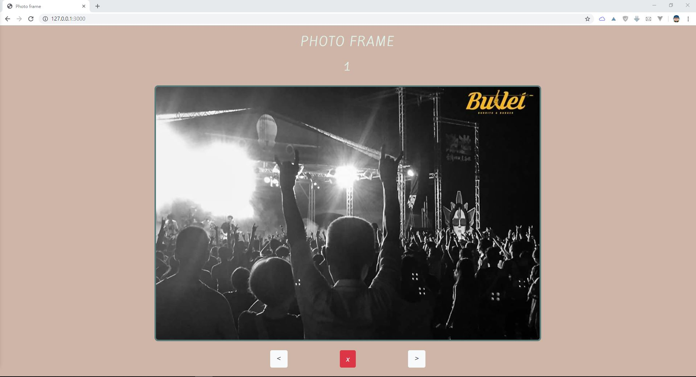
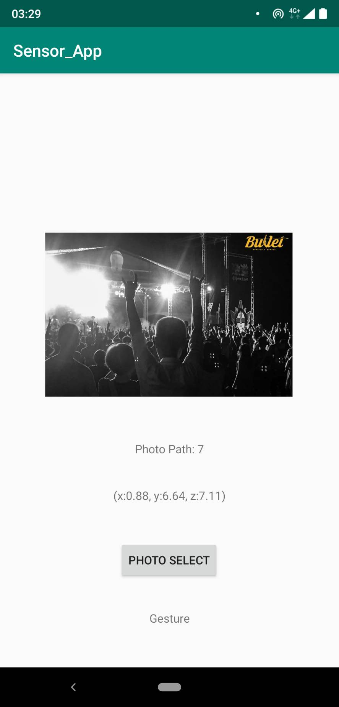

# PhotoFrame APP
An App use accelerometer sensor to determine the user's gesture to select a photo and post it to the server (Photo Frame). 

## The Web View 
We use the web front-end to simulate the photo frame.

## The APP View 
We use accelerometer to determine the user's gesture(shake left, shake right or project). 

